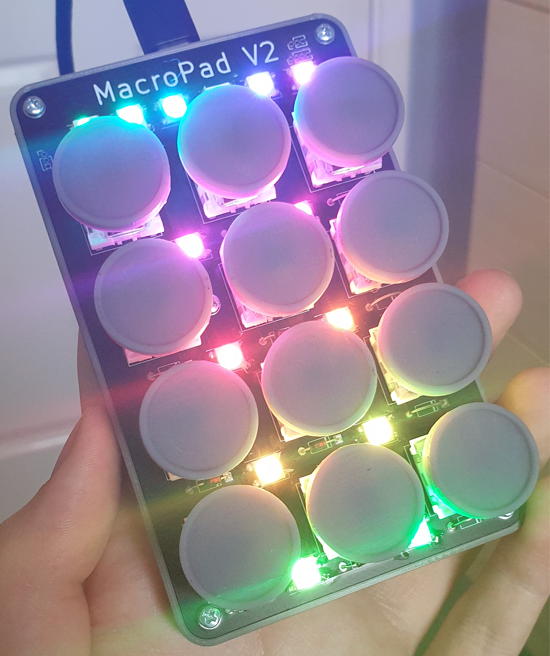

# Macropad-V2-Mini

## What is this?
A PCB-based small form-factor USB keypad with RGB lighting. They keys send a key press (F13-F23) for autohotkey to listen too, then perform the macro.

It consists of 12 Cherry Blue switches, 14 Neopixels, a tiny RP2040 and a custom PCB.
## What is the purpose of this project?
A few years ago I made [this](https://github.com/JackMillen/Macropad), a rough USB Macropad with 13 keys and 5 dials. This version has served me well and is perfect for a desktop, but leaves something to be desired when using it with a laptop.
## Issues with old version
- Too big to carry in a bag
- Too fragile (The wiring is held together with poor soldering, recycled wire and pure spite)
- The keys are misaligned due to sloppy 3D modelling
- Most of the dials do nothing because I don't use midi devices
- It uses USB Micro-B, not Type-C (which is superior in everyway to lightning)
- It looks ugly
- Not enough RGB
- Handwiring sucks
## Features:
- Integrated Neopixels
- Single PCB
- USB C
- Uses Circuit Python
- RGB Animations (Animation Choice persists during power-cycle)
- Low Profile
- Autohotkey Support
- Typewriter Style Keycaps
- Debug pin-headers which allow an external arduino to interface with the PCB for testing

## Issues:
- I f***ed up the diode placement on the circuit, just use wire to bridge the contacts and live with the ghost keys
- The RP2040 doesn't have an EEPROM so I need to boot the RP2040 in read-only mode to save the RGB state in flash
- Writing code is easy. Writing code for other people to use and understand is f***ing hard, so I din't do it. If you are going to make this project, you might want to write your own firmware.

## Weird Notes:
- By default the flash is in Read-Only mode so it can store animation states. To edit the code or put the drive in RW, hold button 1 (Top-Left) while plugging it in. The RGB state won't save until power cycled, but the flash is writable.
